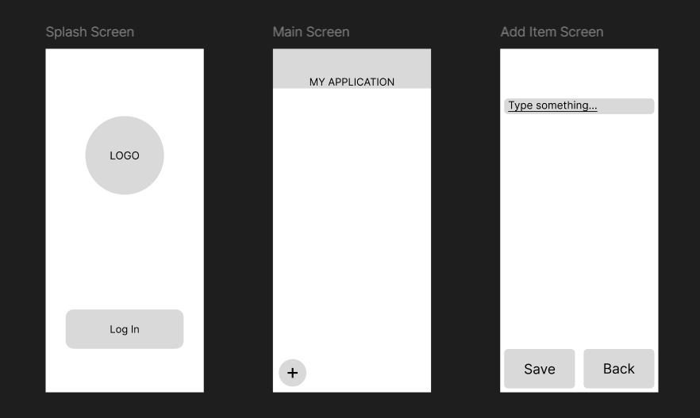
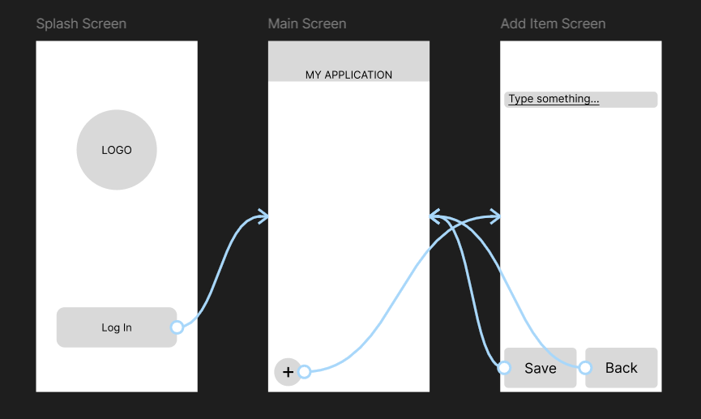
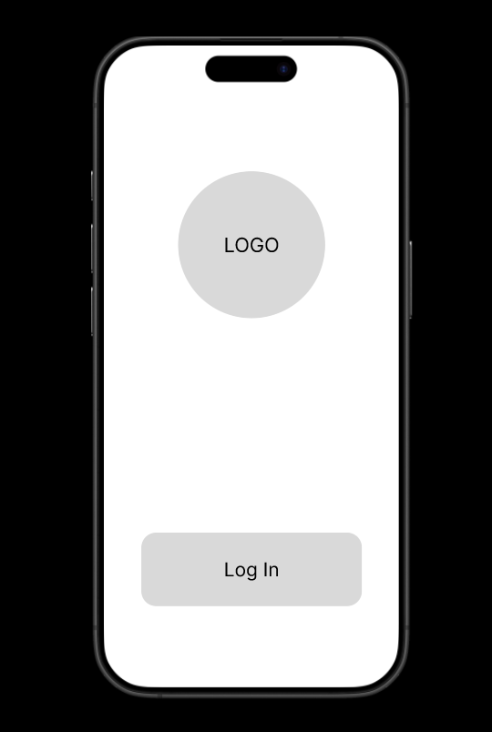
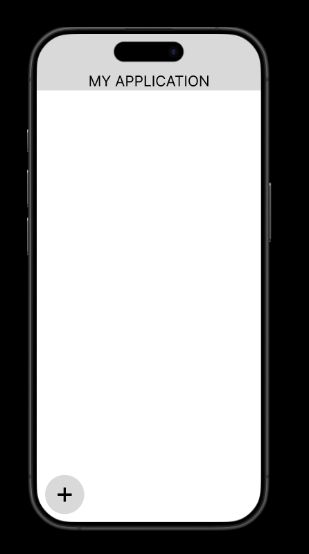
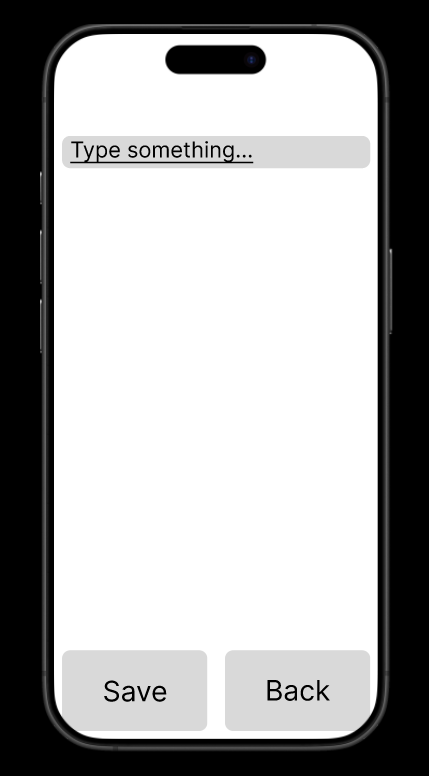

# Скриншот проекта в режиме Design 

# Скриншот проекта в режиме Prototype

# Скриншот проекта в режиме Present

# Отчёт
Было создано 3 экрана:
- Splash Screen - Экран с логотипом и кнопкой авторизации
- Main Screen - Экран главного меню с кнопкой добавления новой задачи
- Add Item Screen - Экран с добавлением новой задачи и двумя кнопками: сохранением и выходом назад

Навигация:
- Log In (Splash Screen) → Main Screen
- "+" (Main Screen) → Add Item Screen
- Save (Add Item Screen) → Main Screen
- Back (Add Item Screen) → Main Screen

# Ссылка на работу
https://www.figma.com/proto/DS82jBcsjPTKWxTqTXmfFD/Prototype_App_Жученко?node-id=1-2&t=15pKR6NINFyLJsGz-0&scaling=scale-down&content-scaling=fixed&page-id=0%3A1